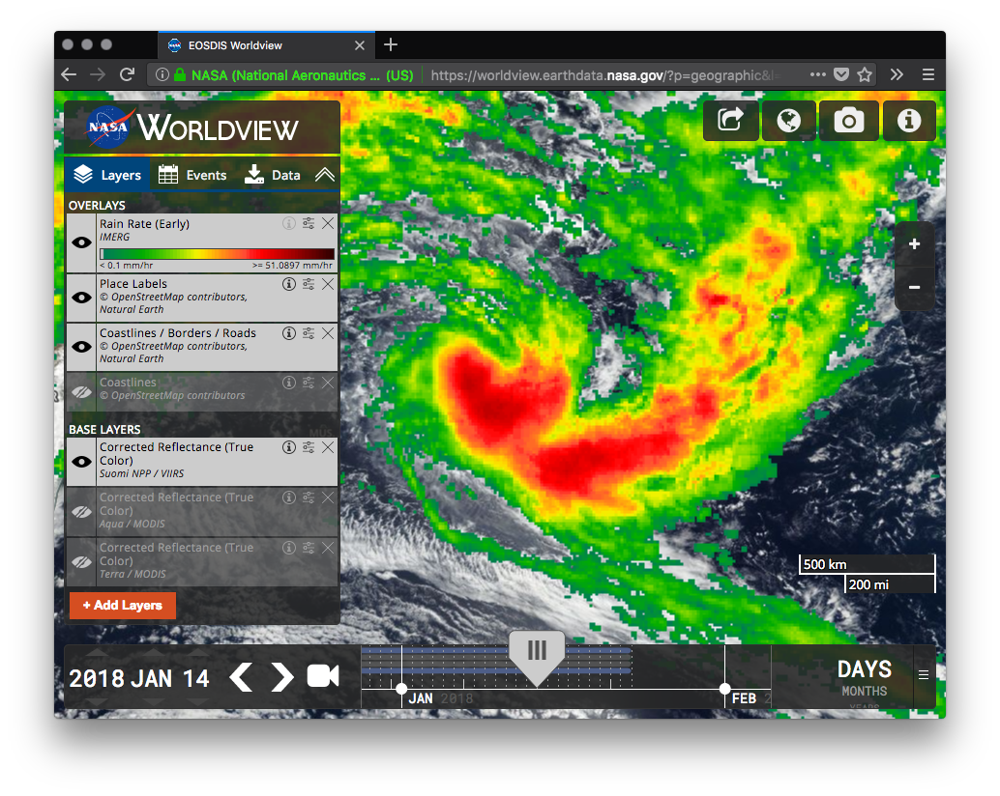

# [Worldview](https://worldview.earthdata.nasa.gov)

[](https://worldview.earthdata.nasa.gov)

[](https://travis-ci.org/nasa-gibs/worldview)

> Interactive interface for browsing full-resolution, global satellite imagery

## Background

This app from NASA's [EOSDIS](https://earthdata.nasa.gov/) provides the
capability to interactively browse over 600 global, full-resolution satellite
imagery layers on desktop and mobile devices. Many of the imagery layers are
updated within three hours of observation, showing the entire Earth as it is
"right now". This supports time-critical applications such as wildfire
management, air quality measurements, and flood monitoring. Some satellite
imagery layers span almost 30 years, providing a long term view of our dynamic
planet. The underlying data is available for download, and Arctic and Antarctic
views of several imagery layers are available for a “full globe” perspective.

Worldview uses [OpenLayers](http://openlayers.org/) to display imagery from the
[Global Imagery Browse Services (GIBS)](https://earthdata.nasa.gov/gibs). This
imagery can also be used [with libraries such as Leaflet, Cesium, Google Maps](https://wiki.earthdata.nasa.gov/display/GIBS/Map+Library+Usage)
or [custom GDAL scripts](https://wiki.earthdata.nasa.gov/display/GIBS/Map+Library+Usage#expand-GDALBasics).
We encourage interested developers to fork Worldview or build their own clients
using GIBS services.

Check out our [roadmap](https://github.com/nasa-gibs/worldview/projects/7)
to see what we're working on and follow our [blog](https://wiki.earthdata.nasa.gov/pages/viewrecentblogposts.action?key=GIBS)
to find out the latest features and imagery available.

## Install

This project uses Node and Python. See the [dependencies](#dependencies) section for more information.

```bash
git clone https://github.com/nasa-gibs/worldview.git
cd worldview
npm install
```
View the [Configuration](doc/configuration.md) section for information on how to install the offical EOSDIS Worldview configuration, or to add your own custom configuration.

### Dependencies

The following are required to install and run Worldview:

- [Node v8.8.1 or Later](https://nodejs.org/en/download/)
  - **Note:** Ubuntu users may run into issues with the `node` command not being available. See [this question on StackOverflow](https://stackoverflow.com/q/18130164/417629) for possible solutions.
- [Python v2.7.14 or Later](https://www.python.org/)
  - **Note:** It is recommended that Windows users install Python with [Windows Build Tools](https://www.npmjs.com/package/windows-build-tools).
  - macOS users should use the `--with-brewed-openssl` option when using Homebrew.

Windows users will also need the following:

  - [Git Bash](https://git-scm.com/downloads), or [MinGW-w64](https://sourceforge.net/projects/mingw-w64/files/External%20binary%20packages%20%28Win64%20hosted%29/MSYS%20%2832-bit%29/)
  - [.NET Framework](https://www.microsoft.com/net/download/dotnet-framework-runtime) or [Visual Studio Team Services](https://www.visualstudio.com/)
  - [Add `python` to the path](https://docs.python.org/2/using/windows.html#excursus-setting-environment-variables)

## Usage

```bash
npm run build
npm start
```

Navigate to [`http://localhost:3000`](http://localhost:3000) in a browser. To stop Worldview, press Control+C in the terminal.

See [Developing](doc/developing.md) for more usage details.

## Updates

To update Worldview, pull down any branch or tag from GitHub. From the `master` branch (default), to update to the latest stable version of Worldview, run `git pull`.

**Note:** This project uses [Semantic Versioning](https://semver.org/). Updates to the major version number in [package.json](package.json) indicate a breaking change; _update with caution_.

## Other Information

* [Developing](doc/developing.md)
* [Testing](doc/testing.md)
* [Configuration](doc/configuration.md)
* [Custom Branding](doc/branding.md)
* [Data Download](doc/data_download.md)
* [Optional Features](doc/features.md)
* [Deployment](doc/deployment.md)
* [Using Apache (deprecated)](doc/apache_setup.md)
* [Uploading](doc/upload.md)

## Contact

Contact us via GitHub or by sending an email to
[support@earthdata.nasa.gov](mailto:support@earthdata.nasa.gov).

## Contribute

We welcome your contributions! Feel free to [open an issue](https://github.com/nasa-gibs/worldview/issues/new) or [submit a PR](https://github.com/nasa-gibs/worldview/compare).

See [CONTRIBUTING.md](.github/CONTRIBUTING.md) for more contribution guidelines.

Worldview and NASA follow the [Contributor Covenant Code of Conduct](.github/CODE_OF_CONDUCT.md).

## License

NASA-1.3 (See [LICENSE.md](LICENSE.md))
